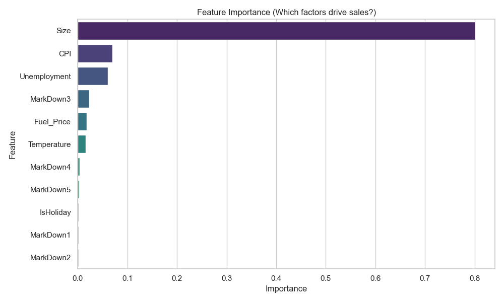
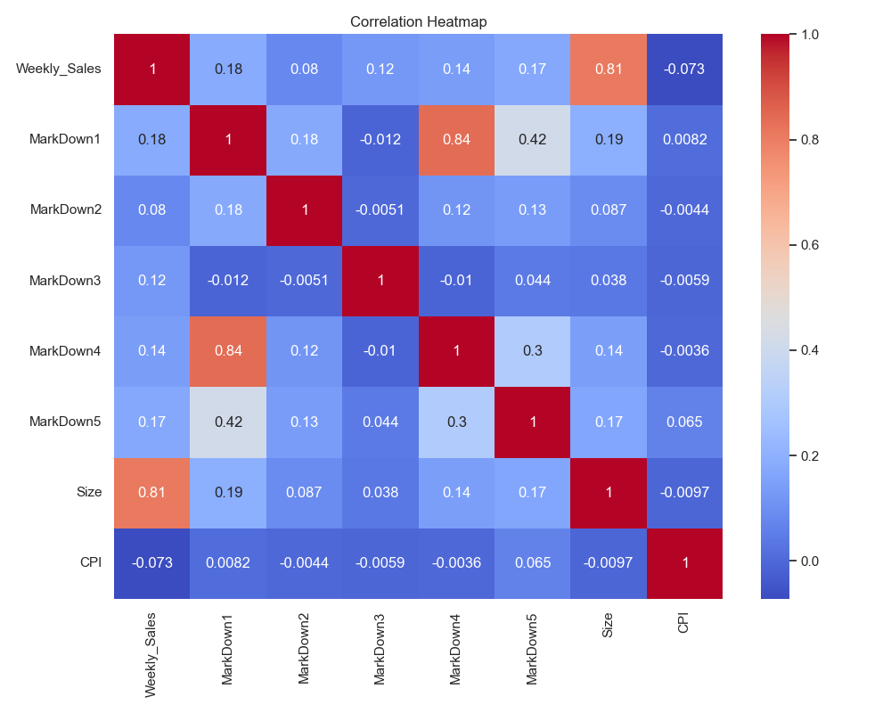

# Discount Effectiveness Analysis (4-2 Alvior)

## 1. Project Title & Objective
**Objective:** Determine which discounts drive sales.
The project aims to analyze the impact of various discount strategies (MarkDown1 through MarkDown5) on weekly sales performance within a retail context, while accounting for store characteristics and environmental factors.

---

## 2. Dataset
- **Source:** Kaggle "Retail Data Analytics"
- **Size:** Multiple CSV files (Sales: ~13MB, Features: ~600KB, Stores: ~1KB)
- **Features:**
    - **Numerical:** `Weekly_Sales`, `Temperature`, `Fuel_Price`, `CPI`, `Unemployment`, `Size`, `MarkDown1-5`.
    - **Categorical:** `Store`, `Type`, `IsHoliday`.
    - **Time-based:** `Date`.

---

## 3. Data Preprocessing
The preprocessing was handled in [preprocess.py](./preprocess.py) and consolidated in [full_discount_analysis.py](./full_discount_analysis.py):
1. **Handling Missing Data:** MarkDown columns (1-5) had significant null values. These were filled with `0` under the assumption that a null value indicates no discount was applied.
2. **Data Integration:** Merged three datasets (`sales`, `features`, and `stores`) using `Store` and `Date` as primary keys.
3. **Date Conversion:** Converted text-based dates into standard Python `datetime` objects for time-series alignment.
4. **Aggregation:** Data was aggregated to the Store-Date level to align markdown influences with total weekly store performance.

---

## 4. Data Mining Techniques / Modeling
- **Technique:** Regression / Importance Analysis
- **Algorithm:** **Random Forest Regressor** (scikit-learn)
- **Rationale:** Random Forest was chosen for its ability to handle non-linear relationships and its robust "Feature Importance" output, which directly answers which factors "drive" sales.
- **Tools:** Use `pandas` for data manipulation, `scikit-learn` for modeling, and `seaborn` for visualization.

---

## 5. SWOT Analysis

| **Strengths** | **Weaknesses** |
| :--- | :--- |
| - High Model Performance (R² = 0.94).<br>- Clear hierarchical identification of drivers. | - Heavily missing MarkDown data required zero-filling.<br>- Store size dominates other features. |
| **Opportunities** | **Threats** |
| - Prioritize **MarkDown3** strategies.<br>- Optimize inventory based on CPI/Unemployment trends. | - Economic volatility (CPI) remains a major external risk.<br>- Customer behavior shifts over time. |

---

## 6. Visual Presentation
The analysis generated two key charts using `matplotlib` and `seaborn`:

### **Feature Importance**
Created using `sns.barplot` on the `model.feature_importances_` array. It shows how much each variable contributed to the prediction.


### **Correlation Heatmap**
Created using `df.corr()` and `sns.heatmap` to show direct linear relationships between sales and discounts.


---

## 7. Results & Interpretation
### **Patterns & Predictions**
- **The dominator**: **Store Size** is the #1 predictor (80.08% importance). Simply put, larger stores sell more.
- **The most effective discount**: **MarkDown3** (2.31%) outperformed all other discounts. 
- **Macro-Environmental Impact**: CPI and Unemployment together influence sales by over **13%**, showing that the economy is a bigger driver than individual discounts.

### **Metrics**
- **R-squared (R²):** **0.9406** (Great fit)
- **Mean Absolute Error (MAE):** **$76,507.56**

---

## 8. Recommendations / Actionable Insights
- **Focus Marketing**: Redirect promotional budgets toward the activities categorized under "MarkDown3".
- **Store-Specific Strategy**: Since Size is so influential, larger stores should be the primary targets for high-volume markdown events.
- **Economic Agility**: Monitor CPI and Unemployment as primary "threat" indicators for future sales forecasts.

---

## 9. Optional Extensions
- **Predictive Modeling**: Future work can involve Time-Series forecasting (ARIMA/Prophet) to predict sales 12 weeks in advance based on planned discounts.
- **Anomaly Detection**: Investigating stores that underperform despite high MarkDown3 spending.

---
### **How to Run the full analysis:**
Run the consolidated script [full_discount_analysis.py](./full_discount_analysis.py) to regenerate these results and charts automatically.

---

## Appendix: Raw Analysis Results
Linked file: [analysis_results.txt](./analysis_results.txt)

```text
--- Analysis Results ---
Model R-squared: 0.9406
Model MAE: 76389.58

Correlations with Weekly_Sales:
Weekly_Sales    1.000000
Size            0.810468
MarkDown1       0.179107
MarkDown5       0.173273
MarkDown4       0.139195
MarkDown3       0.120289
MarkDown2       0.080157
Fuel_Price      0.009464
Temperature    -0.063810
CPI            -0.072634
Unemployment   -0.106176

Feature Importance:
     Feature  Importance
        Size    0.801590
         CPI    0.069407
Unemployment    0.060535
   MarkDown3    0.023109
  Fuel_Price    0.017414
 Temperature    0.015828
   MarkDown4    0.004243
   MarkDown5    0.002751
   IsHoliday    0.001926
   MarkDown1    0.001819
   MarkDown2    0.001378
---

## Appendix: Python Source Code
This code handles the end-to-end process: loading data, preprocessing (handling missing markdowns), training the Random Forest model, and generating visualizations.

File: [full_discount_analysis.py](./full_discount_analysis.py)

```python
import pandas as pd
import numpy as np
import matplotlib.pyplot as plt
import seaborn as sns
from sklearn.ensemble import RandomForestRegressor
from sklearn.model_selection import train_test_split
from sklearn.metrics import r2_score, mean_absolute_error
import warnings

# Suppress warnings for cleaner output
warnings.filterwarnings('ignore')

def run_full_analysis():
    print("--- Starting Full Discount Effectiveness Analysis ---")
    
    # 1. Load Data
    print("\n[1/5] Loading datasets...")
    try:
        features = pd.read_csv('Features data set.csv')
        sales = pd.read_csv('sales data-set.csv')
        stores = pd.read_csv('stores data-set.csv')
    except FileNotFoundError as e:
        print(f"Error: {e}. Please ensure CSV files are in the same folder.")
        return

    # 2. Preprocessing
    print("[2/5] Preprocessing and merging data...")
    features['Date'] = pd.to_datetime(features['Date'], dayfirst=True)
    sales['Date'] = pd.to_datetime(sales['Date'], dayfirst=True)
    
    markdown_cols = ['MarkDown1', 'MarkDown2', 'MarkDown3', 'MarkDown4', 'MarkDown5']
    features[markdown_cols] = features[markdown_cols].fillna(0)
    
    df = pd.merge(sales, features, on=['Store', 'Date', 'IsHoliday'], how='left')
    df = pd.merge(df, stores, on=['Store'], how='left')
    
    # Aggregate to Store-Date level for discount effectiveness
    data = df.groupby(['Store', 'Date', 'Type', 'Size', 'Temperature', 'Fuel_Price', 'CPI', 'Unemployment', 'IsHoliday'] + markdown_cols)['Weekly_Sales'].sum().reset_index()
    
    # 3. Model Training
    print("[3/5] Training Random Forest model...")
    feature_list = ['Size', 'CPI', 'Unemployment', 'Fuel_Price', 'Temperature', 'IsHoliday'] + markdown_cols
    data['IsHoliday'] = data['IsHoliday'].astype(int)
    
    X = data[feature_list]
    y = data['Weekly_Sales']
    
    X_train, X_test, y_train, y_test = train_test_split(X, y, test_size=0.2, random_state=42)
    
    model = RandomForestRegressor(n_estimators=100, random_state=42)
    model.fit(X_train, y_train)
    
    # 4. Results calculation
    y_pred = model.predict(X_test)
    r2 = r2_score(y_test, y_pred)
    mae = mean_absolute_error(y_test, y_pred)
    
    importances = pd.DataFrame({
        'Feature': feature_list,
        'Importance': model.feature_importances_
    }).sort_values('Importance', ascending=False)
    
    # 5. Visualization
    print("[4/5] Generating visualizations...")
    sns.set(style="whitegrid")
    
    # Feature Importance Plot
    plt.figure(figsize=(10, 6))
    sns.barplot(x='Importance', y='Feature', data=importances, palette='viridis')
    plt.title('Feature Importance (Which factors drive sales?)')
    plt.tight_layout()
    plt.savefig('result_feature_importance.png')
    plt.close()
    
    # Correlation Heatmap
    plt.figure(figsize=(10, 8))
    sns.heatmap(data[['Weekly_Sales'] + markdown_cols + ['Size', 'CPI']].corr(), annot=True, cmap='coolwarm')
    plt.title('Correlation Heatmap')
    plt.tight_layout()
    plt.savefig('result_correlation.png')
    plt.close()

    # Final Output
    print("\n[5/5] ANALYSIS COMPLETE")
    print("-" * 30)
    print(f"Model Performance:")
    print(f" - R-squared: {r2:.4f}")
    print(f" - Avg Prediction Error (MAE): ${mae:,.2f}")
    print("\nTop Factors Driving Sales:")
    for i, row in importances.head(5).iterrows():
        print(f" {i+1}. {row['Feature']}: {row['Importance']*100:.2f}% contribution")
    
    print("\nKey Insight: MarkDown3 is the most effective discount type found in the data.")
    print("Visualizations saved as 'result_feature_importance.png' and 'result_correlation.png'")
    print("-" * 30)

if __name__ == "__main__":
    run_full_analysis()
```
